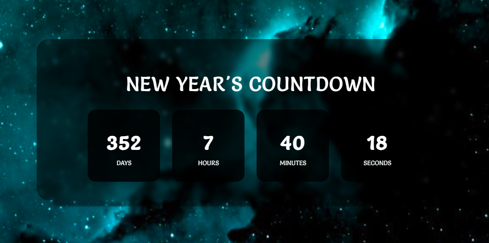

# Countdown Timer ReactJs Component
The Countdown Timer is a React-based web application that displays a real-time countdown to a specified event date. It provides an intuitive and visually appealing and responsive user interface to keep users informed about the time remaining until the event(such as New Year's).

## Installation

Follow these steps to set up and run the Countdown Timer project locally:

1. **Clone the repository:**
   ```bash
   git clone https://github.com/your-username/countdown-timer.git

2. **Navigate to Project Directory:**
cd countdown-timer

3. **Install dependencies:**
npm install

4. **Run the development server:**
npm run dev

5.**Open in Browser**
Open your browser and go to http://localhost:3000 to view the Countdown Timer.

## Requirements
Make sure you have Node.js and npm installed on your system.

This set of instructions assumes you are using npm as your package manager. If you use yarn, replace npm with yarn in the commands.




## Technologies Used
- React
- JavaScript (ES6+)
- CSS
- HTML

